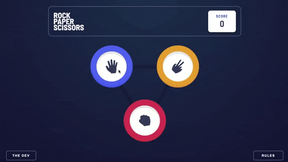

# Frontend Mentor - Rock, Paper, Scissors solution

This is a solution to the [Rock, Paper, Scissors challenge on Frontend Mentor](https://www.frontendmentor.io/challenges/rock-paper-scissors-game-pTgwgvgH). Frontend Mentor challenges help you improve your coding skills by building realistic projects. 

## Overview



### The challenge

Users should be able to:

- View the optimal layout for the game depending on their device's screen size 
  - mobile: 360px
- Play Rock, Paper, Scissors against the computer

### Links

- Live Site URL: [Rock, Paper, Scissors](https://rock-paper-scissors-one-psi.vercel.app/)

## My process

I like styling as I build out the html layout. Once the page looked like it should, I added the javascript and animations.

### Blockers

I perceived that the shadows in each choice button were gradients. Later, with the help of another developer, I found out that they were box shadows using the inset value. 

### Built with

- Semantic HTML5 markup
- CSS
- Flexbox

### Code I'm Proud of

> This function appends the words 'rock', 'paper', 'scissors' to the loading circles after the player makes their choice. 
> It simulates the game play where the players speak the name of the game ("Rock! Paper! Scissors!")
> I used the setInterval method which evaluates the callback function for setting the text every second (1000ms).

```js
function loadShot() {
  let count = 0
  const readyArr = ['paper', 'scissors']
  const setText = setInterval(() => {
    const innerChoiceLoading = document.querySelectorAll('.inner-choice-loading')
    innerChoiceLoading.forEach((loader) => loader.textContent = readyArr[count])
    count += 1
    if (count === 3) {
      clearInterval(setText)
    }
  }, 1000);
}
```

## Author

- Website - [Stefon Simmons](https://www.stefonsimmons.me)
- Frontend Mentor - [@StefonSimmons](https://www.frontendmentor.io/profile/stefonsimmons)
